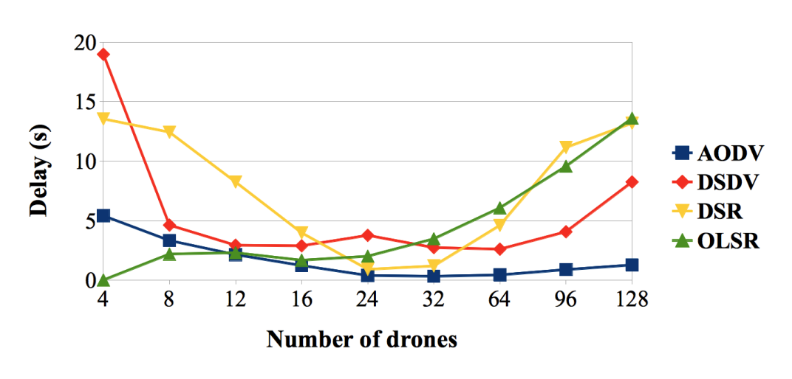

# Networks of Drones
20.okt

This is the intro the drones and drone networks which will be useful in the [project](https://github.com/Andrea94c/DroNETworkSimulator). UAV, unmanned aerial vehicle, range tons in size, with some being as small as [0.5g](https://wyss.harvard.edu/technology/robobees-autonomous-flying-microrobots/). 

Drones can provide connectivity in disaster areas, acting as flying [BSS](https://www.geeksforgeeks.org/introduction-of-basic-service-set-bss/#:~:text=Basic%20Service%20Set%20(BSS)%2C,i.e.%20AP%20(Access%20point).&text=BSS%20basically%20contains%20only%20one,wireless%20devices%20within%20the%20network.) or relay nodes. Here the [LPWAN](https://en.wikipedia.org/wiki/Low-power_wide-area_network), low power wide area network (e.g LoRa- long range) is a possible solution for the MAC. 

When it comes to drones the following .
 - Topology: **Mesh Jeopardized**. Jeopardized meaning that they are not connected to each other. This comes with high mobility with movement on a 3D plane
 - Infrastructure: __Absent (depot)__. Here the depot is the sink.
 - Energy source: __Battery__. Most drones are battery powered

Due to the high mobility of dronets, the proactive protocols are not possible due to the constant need to update topology changes. The reactive protocols is an on-demand protocol where the route is found when needed. Hybrid protocols are not good either because the proactive parts bring down performance. 

 Geographic protocols works better, since there are no tables and no routes. Georaphic routing schemes also do not need the entire network information, they simply keep the neighbours location in mind and try to send packets that correspond to the longest jump towards the destination address.  

Performance evaluation based on different routing algorithms show that __AODV__ protocol have a low delay and that reactive protocols do a better job in general. 

Geo-routing has three main approaches:
- Store-carry and forward
  - When the network is intermittently connected, drones do not always have neighbours, so they hold the packet until a relay node or the destination is found to pass on the packet to.

- Greedy forwarding
  - Choose the node closest to the target destination, though this does not guarantee the shortest transmission time.

- Prediction
  - Predict future postion of relay nodes to see if a node for instance is moving towards the destination.

Next lesson: Make our MAC protocols smarter using reinforcement learning.