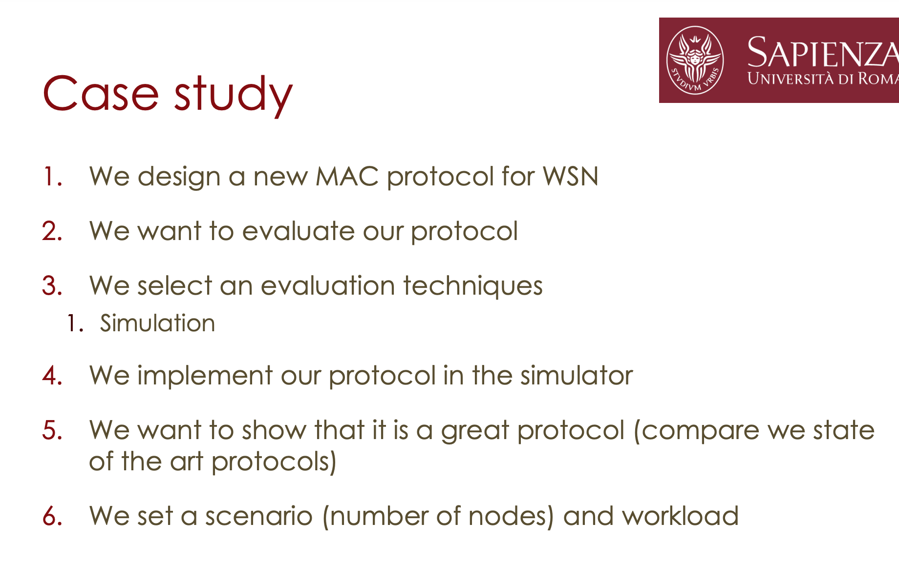

# Performance evaluation
<sub>25.okt</sub>

### A systematic appraoch
- State goals and define the system
- List services and outcomes
    - success or failure in packet delivery
    - Sink node
- Select metrics
    - delivery ratio, energy consumption, network lifetime
- List parameters
    - number of ndes, duty cycle, transmission cost
- Factors to study
- Select evalutaion technique
    - simulation
- select workload
    - packets generated, number of data flows
- design experiments
    - maximize information extraction with minmal effort
- analyze and interpret data
- present results
    - make graphs etc. (plot energy consumption by varying message inter arrival time)
 
 When deciding the evalution technique, the stage in of the life-cycle is important. In a new system, only analytical modeling and simulations are possible. In a prototype or improved system, you use measurements (also modeling and simulation). 


Accuracy is low with analytical modeling since it requires many simplifications. Simulations are more accurate, and measurements have very variable and incosistent accuracy due to the environmental parameters, making each experiment unique.


### An important rule of validation

_Do not trust the result of a (simulation/modeling/measurement) until they have been validated by (simulation/modeling/measurement) or (simulation/modeling/measurement)_

To validate the results of one, use another measurement method and see that you get similar results. The use of all three methods is the most complete.

Performance is measured by the metrics __time__ taken (responsiveness), the __rate__ at which the service is performed (productivity) and the __resources__ consumed (utilization).

Select a subset of metrics out of all possible measurement methods so as to fulfill the non-redundancy and completeness requirements. Non-redundancy is avoiding cases where two metrics give the same information, and completeness is representing all possible outcomes.



### When summarizing measured data, you summarize by a single number or summarize variability.

To summarize a single number, you can use the empirical mean (average value). This is only representative with a small number variance. You can also use geometric mean. The geometric mean of n values x1,x2,…,xn is obtained by multiplying the values together and taking the nth root of the product.


Systems with low variability are preferred. Variance is measured in the square unites. You measure the average, and then sum the difference between x1 value and the average x2 value etc. You sum all these values.

Use Quantiles for a better representation. 


Command-line drive graphing utility:

gnuplot.info

gnuplot.sourceforge.net/demo


## DroNETworkSimulator

Green dot: you have a packet <br>
Black: you have "nafffing" <br>
Retr: Number of times u tried to send packets

The packets are sent to base station, the red triangle at the bottom.

Drop the graphical interface by changing to ```PLOT_SIM=FALSE``` in utilites. Also speed up by removing the 0.1s step delay in ```WAIT_SIM_STEP=0```. You can also plot fewer points in the graphical interface to increase speed.

To go back in time to a previous step, you can save the simulation by turning the ```SAVE_PLOT=TRUE``` which saves the pictures in ```SAVE_PLOT_DIR=data/plots/```

To implement your own routing. Create a new file/dulicate an existing routing into the routin dir. Make a class of your routing where you define the ```relay_selection(self, opt_neighbours)```. opt_neighbours is the list of drones you can communicate with.

When changing the used routing, import it in utilites and insert in ```Routing algorithm(Enum)``` and finally change the routing variable.

The demo_path is used for you to test your implementation. Enable it and put the number of drones to two to better understand what's going on in a simulation. To make debugging more clear, in relay selection change the printing to only one of the drone by inserting something like ```if self.drone.identifier==0```.

```
#Drone 0 sends packet to drone 1
#in relay function
drone_to_send=n None
for hll_pck, clone_Drone in opt_neighbors:
    if close_drone.identifier==1:
        drone_to_send=close_drone
    pass


return drone_to_send
```

A geographical approach requires the energy, speed and trajectory of other drones. The ```HelloPacket(Packet)``` class has the information about the drone. Btw don't use the **src_drone** parameter as that is accessing simulation data which is cheating.

```
#Drone 0 sends packet to drone 1
#in relay function
depot_pos=self.drone.depot.coords
my_distance_from_bs=util.euclidean_distance(self-drone.coords,depot)
drone_to_send=n None
#start score with big number
current_score= np.inf

for hll_pck, clone_Drone in opt_neighbors:
    close_drone_pos=hll_pck.cur_pos
    close_drone_speed=hll_pck.speed
    hll_pck_timestep_creation=hll_pck.time_step_creation
    next_target_close_drone = hll_pck.next_target #Where is it going?

    # util.euclidean_distance ( --> meters)
    delta_timesteps=None
    delta_seconds = delta_timestamps * self.simulator.time_step_duration

    distance_close_crone_to_Bs= util.euclidean_distance(close_drone_pos,depot_pos)

    if depot_close_drone_to_bs < my_distance_from_bs and distance_close_drone_to_bs < curren_score: 
        drone_to_send= close_drone
        current_score=distance_close_drone_to_bs
        

return drone_to_send
```

For every simulation you run, you get a JSON file. This will help you work with finding something like the mean and plot the data. Use a library to read the JSON files. Make a script to work on many JSON files.
