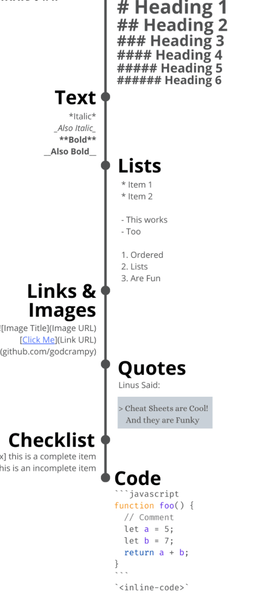

# Foundations of Data Science
## h2
** Trying out markdown coz u can do this $\sum{x=y}$ _and this_ $\frac{a^2+1}{(b_1*b_2)/b^2_3}$

he said:
> This is a quote

**Bold text**

>_And this is a quote in italic_



#### Note the following about images
1. It has to include the image type, in this case png
2. No spaces between the following elements ``
3. Don't add tabs or spaces in front of paragraphs
- You can have 
  - Nested lists 
    - Just rememeber spacebar before the `-`

```js

if (understood) {
    return true
} else {
    read_again()
    return -1
}

```
<sup>instead of the first line being \``` you could write ```js, then JavaScript highlighting will be applied to the block.</sup>


[To include a link do this](https://www.markdownguide.org/basic-syntax/)

Use backslash as such to display key characters \*

[//]: # (This comment won't be rendered to the visitor! The double-slash is the link id, the hash is the URL, and the comment in parenthesis is the link title.)

[//]: # (Capisco? :sparkles:
\- \[x] Ja
\- [ ] Nei) 


First Header | Second Header  
------------ | ------------- 
Content cell 1 | Content cell 2
Content column 1 | Content column 2 