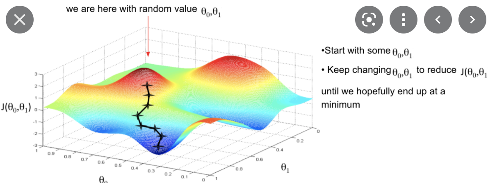

# Digital Image Processing
18.okt

Gradient descent algorithm

What is gradient descent?
What is $a$ in the formula, and why is gradient descent slow if alpha is small. On the contrart if $a$ is too large, gradient descent overshoots the minimum. What does failing to converge, or even diverge, mean?

In linear regression we are trying to find the global minimum of the graph. $a$ decreases over time in the gradient descent algorithm.

The linear regression model. There we have the hypothesis

In the case of linear regression we have a bowl-shaped convex function so you avoid local minimums since there is only a single global minimum.

Finding the global minimum shows the smallest error rate you can achieve with the current algorithm. 

The gradient is the result of considering all dataset examples. This is ineffective, thereby we introduce _Stochastic Gradient Descent (SGD)_. There we eliminate the summation of all i, since you are only considering one point at a time. 

Q: We will consider all points, one at a time, rather than summing them. How does this save computation costs?

Q: How does the SGD algorithm follow the slope even though single elements

_Mini-batch gradient descent_ is a good compromise between the effectiveness of _SGD_ and the detail and accuracy of _Gradient Descent_. Here you take for instance a mini-batch of 100 shuffled data points at a time, until you reach convergence. This is smoother than SGD and faster than vanilla Gradient Descent

Lekse: [Gradient Descent](https://builtin.com/data-science/gradient-descent), [Cost function](https://towardsdatascience.com/machine-learning-fundamentals-via-linear-regression-41a5d11f5220), [Linear regression](https://towardsdatascience.com/coding-deep-learning-for-beginners-linear-regression-part-2-cost-function-49545303d29f)

Feature scaling ensures that you converge the center with less iterations. You want to get every feature approximately in the range  $a-1 ≤ x_i ≤ 1$ . 

You can declare convergence if J(0) decreases by less than $10^{-3}$ in one iteration.

> If $a$ is too small, slow convergence  
> If $a$ is too large: J(0) may not decresease on every iteration, may diverge

### Example: Housing prices prediction
$h_0(x)=0_0+0_1*frontage+0_2*depth$

Note that in Amsterdam, the larger the facade, the more costly the house

You could use a polynomial regression for the resulting function, but be aware of overitting and underfitting. For instance while a parabol function might look right at first it will have this shape $\bigcap$ which will turn out to be wrong for a lot of the data points later in the range.

Underfitting $h_0. 0_0 + 0_2 ‰ + 0_2 ‰^2$

## Normal Equation
21.okt

[Lekse: ](https://towardsdatascience.com/machine-leaning-cost-function-and-gradient-descend-75821535b2ef)

The trace $tr$ is the sum of the elements on the diagonal. 

$tr AB = tr BA$

$f(A) = tr BA$

$tr A = tr A^T$ where $^T$ is the transpose. The trace of matrix

If $a E R$ then $tr a = a$

### lost af her, sjekk reference på powerpointen han legger ut, les boka
