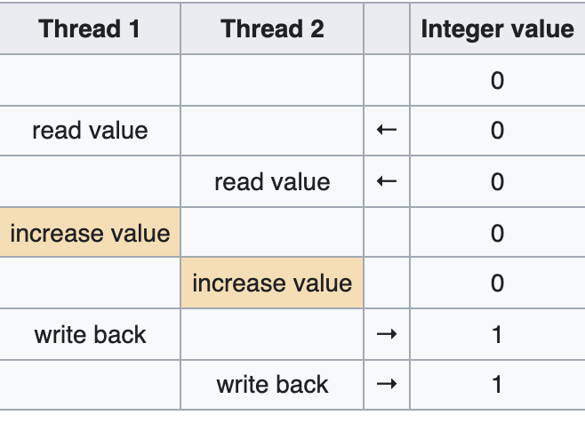

# Security Principles
<sub>19.okt</sub>

### Race conditions

A race condition occurs when two concurrent execution threads both execute on shared state and this is not done atomically. As an example you can take advantage of `mkdir` on Unix by creating symbolic links between the non-atomic directory creation actions to become the owner of files one should not have access to.



Another example is the `1pr` command which prints utility and has the option to remove the file after printing. An attacker could try to go in between the print and remove actions and change the file that is being worked on to as the following remove command targets it. This is how race conditions can also be a security vulnerability.

Due to the rise of multithreaded-CPUs the future of programming is in writing concurrent programs, which gives rise to issues involving data races in code.

["The free lunch is over: a fundamental turn towards concurrency in software", by Herb Sutter](http://www.gotw.ca/publications/concurrency-ddj.htm)


> Semaphores and locks are mechanisms that prevent concurrent access to, or modification of, an object by different processes.

The java synchronized method ensures a lock so one can be safe that variables inside of the method will not change while in use.

- Scann tmp/junk for new creation and use `nice` command to make it run slowly in the backgorund while the scanner runs in the foreground
- When scanner spots new directory:
    - Remove the original /tmp/junk
    - Create a link from the secret file you want

A issue found in SSL approximates to the following, where step 2 and 3 occasionally get swapped:
1. Load buffer with plaintext
2. Encrypt buffer
3. Send buffer contents to recipient


## Security principles
- Secure the weakest link
  - This requires good risk analysis
- Practice defence in depth
  - Avoid SPOF, and beware of typical violations where for instance if you have a firewall, and only a firewall, than so-called enviromental creep, aka a user bringing their own laptop to circumvent the firewall, may still do damage.
  -  Use access control, encrypt files
    - On UNIX systems, the password file /etc/passwd, containing hashed passwords, was world readable (not good).
    - [Read on the Sun tarball problem (1993)](http://etutorials.org/Programming/secure+coding/Chapter+1.+No+Straight+Thing/1.3+Why+Good+People+Write+Bad+Code/)
- Least privilige
  - Device drivers running in kernel mode (bad).
  - In java:
    - ```grant codeBase```
    - Avoid public when you can use ```private``` or ```package```:
      - not ```public int x;```
      - but ```private int x;```
- Compartmentalize
  - Run web application on a different machine from user database
  - Sealing different compartments of a ship will delay sinking.
  - Partition harddisk and install OS twice
  - ```chroot``` jail (change a users home directory)
  - Virtualization, (using [hypervisor](https://www.vmware.com/topics/glossary/content/hypervisor#:~:text=A%20hypervisor%2C%20also%20known%20as,such%20as%20memory%20and%20processing.))
- Minimize attack surface
  - Minimize open sockets, services, admin accounts, directories with weak access control etc.
  - Log off user/lock screen after n minutes
- Use security defaults
  - Safety without the admin having to actively monitor
- Keep it simple stupid (KISS)
  - Complexity leads to unforeseen feature interaction
  - using a so-called choke point, a small interface through which all control flow must pass.
- Fail securely
  - if something fails, you don't compromise security policy
  - incorrect handling of unexpected errors is a major cause of security breaches
  - Failing insecurely can lead to information leakage, ignoring errors, misinterpreting errors etc.

- Promote pricacy
  - ```telnet``` giving away too much information
  - Blind SQL injection relies on extracting information about the structure of the database, also upon failing insecurely.
- Kerckhoffs principle
  - Assume attackers know the source code, and can reverse engineer binaries. Security by obscurity is a bad idea!
  - Use community resources to avoid known mistakes, and don't implement your own cryptography.
- Principle of psychological acceptance
  - Users are lazy, don't make security mechanism cumbersome
- Clearly assign reponsibilites
  - Organizational level
    - One person responsible for something, rather than two or a whole group
  - Coding level
    - One module/classresponsible for input validation, access control etc.
- Identify your assumptions
  - These may be sources of vulnerability
  - Also Minimize TCB (Trusted Computer Base)
- Be edgy, trust no one. 
  - All input is evil! (buffer overflow, SQL injection, XSS on websites)
  - Third party software.

Saltzer and Schroeder design principles go through much of the same.